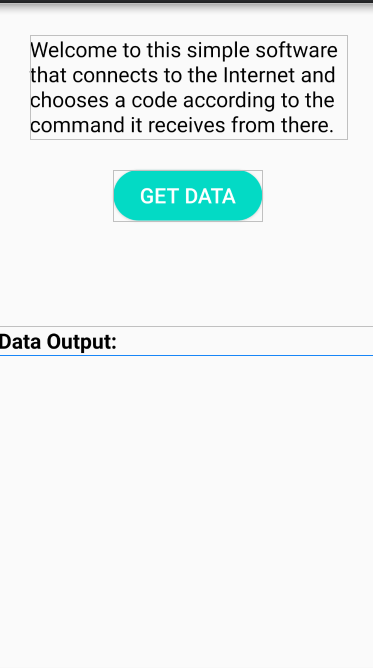

# Control your app with WWW(World Wide Web) server
You can check your Android software with a WWW server. For this, some people use Firebase, DNS, etc. it uses methods and this software uses the WWW server quite simply.

  
